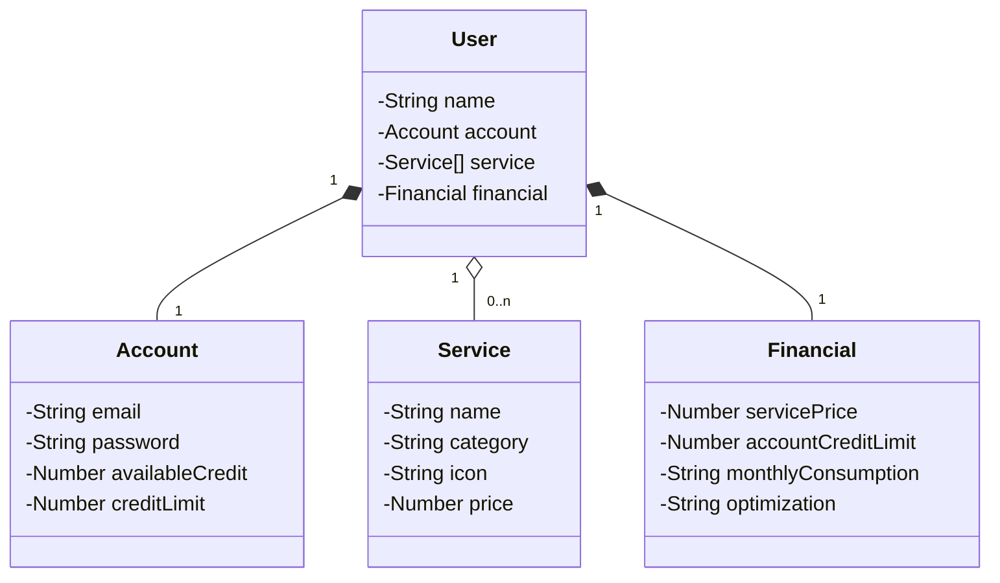

# StreamWise

Java Restful API criada para gerenciar Streamings e Serviços

## Diagrama de Classes

```mermaid
classDiagram
    class User {
      -String name
      -Account account
      -Service[] service
      -Financial financial
    }
    
    class Account {
      -String email
      -String password
      -Number availableCredit
      -Number creditLimit
    }
    
    class Service {
      -String name
      -String category
      -String icon
      -Number price
    }

    class Financial {
      -Number servicePrice
      -Number accountCreditLimit
      -String monthlyConsumption
      -String optimization
    }

    User "1" *-- "1" Account
    User "1" o-- "0..n" Service
    User "1" *-- "1" Financial
    
```
